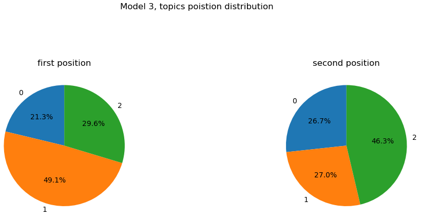
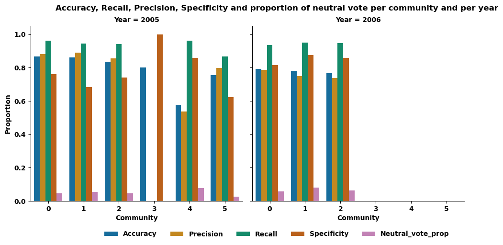

<link rel="stylesheet" href="/css/styles.css">

<h1 style="text-align: center;"> The Power of Online Communities and the Art of Large Scale Decision Process </h1>

How wonderful are the online communities! In the vast landscape of the digital era, the emergence of online communities stands as a demonstration of the transformative power of the internet. This virtual world offers a unique and powerful mean for people from every part of the globe to connect and exchange ideas, fostering the development of new tools and platforms from collaborative efforts, of which Wikipedia is a prime example. However, the growth of these communities brings along a new set of challenges related to the organization and management at such a large scale: How can thousands to millions of users make a decision together and agree on common rules and goals?

To address this question, we study the case of Wikipedia, the largest online encyclopedia, which has been built and maintained by millions of volunteers over the past two decades. In particular, we focus on the English Wikipedia, which is the largest Wikipedia edition with 7 million articles and 46 million registered users and for which we have access to a comprehensive dataset spanning from 2003 to 2013, focusing on Wikipedia elections, namely the : “Requests for Adminship” (RfA), as well as a dataset of the number of monthly edits per user over the same period.
The relevance of choosing Wikipedia as a case study is twofold. First, Wikipedia is a unique example of a large-scale online community that has been able to sustain itself over the years and despite its impressive growth. Second, Wikipedia has a well-defined and transparent process for electing administrators with publicly available data, which makes it an ideal case study for understanding the dynamics of collective decision-making in online communities.

--------------------------

## *Time Series analysis* 

One first step towards understanding the process of collective decision-making is to study the dynamics of voting behavior over time. In particular, we are interested in the temporal patterns of votes and how they relate to the final outcome of the election.
To extract the timing of votes, we used the timestamps given in the raw data and defined the first vote casted for a target as the starting point of an election round. From there, we wondered if we could extract groups of voters that would vote earlier or later in the election which would be indicative of influential and influenced voters respectively.

PLOT DISTRIB VOTING TIME WITH YEAR TO ADD

By seeing the distribution of voting times, we were surprised to discover a bimodal distribution (when using a log scale) and in conjunction with our idea of splitting voters into two groups, we were tempted to explain this phenomenon as indicating the actual existence of two groups of voters separated by their voting time. However, after some investigation of the data and looking into the literature about the RfA rules, we quickly realized that this bimodal distribution can actually be easily explained by the fact that some targets that were not elected would be re-nominated and thus would have a second round of votes (or even more). And after delving deeper into the data and with the information we found on the RfA process, we were able to define properties of the voting time enabling us to distinguish multiple rounds of votes for a given target. We could also check that the resulting rounds were consistent with the data by extracting some comments coherent with our assumptions.
EXAMPLE ROUND NUMBER 7

ADD TABLEAU

Once this processing step done, we ended up with a heavy tailed distribution of voting times with a median of 2 days, consistent over the years. 

Our attempt at extracting 2 voting groups therefore does not seem to correspond to the reality of votes, but instead of coming to a conclusion too quickly, we preferred to verify our hypothesis by directly examining the behavior of sources. We extracted the mean and standard deviation of each source votes and displayed their distribution.

Once again we get a normal unimodal distribution, such that we can not infer any voting group.

To carry on in the present manner, we decided to focus on votes themselves, in particular on their evolution over time. More precisely, we wanted to know if supporting or opposing votes are homogeneous over time, or conversely if they diverge at a certain point to reinforce the final decision. We therefore computed the evolution of the mean of votes over time and for each election.

Much to our surprise, we saw that the outcome of an election was in fact determined rather quickly in most cases, as suggests the clear separation of means at the beginning of the election (after aggregating all rounds for all targets) for all successful and failed nominations (left figure). This plot also allowed us to verify that the proportion of positive and negative votes was indeed correlated to the final decision of the election, as suggests the absence of overlap of confidence intervals of the means. To go further, we also computed the evolution of the quartiles and the median of votes over time to learn about the dispersion of the trends and it is clear that the distributions are clearly distinct this time as well (right figure), with again a clear gap at the very beginning of the election, that only slightly decreases.

It is therefore obvious that the outcome of an election is determined very quickly and that votes that follow mostly go along with it, only slightly alleviating the initial trend. To go further in this analysis, we decided to implement a classification model enabling to predict if an admin will be elected or not only given the first votes input.

XXXXX

XXXXXX

XXXX

XXX

XXXX
--------------------------

## *Topic analysis* 

In this part of the analysis we want to focus on understanding what matters the most in influencing the result of an election, by using the comments that voters may write while casting their votes. 

To do so we used topic modeling to see what topics are more prevalent amongst the comments. We use the Latent Dirichlet Allocation (LDA) algorithm to extract the topics. The prevalent hyperparameter of this method is the number of topics we want to extract, the number of latent dimensions. The LDA algorithm outputs, for each comment, the proportion of comments that can be attributed to each topic. And for each topic of the model we have the list of words, for each topic, with the likelihood of each word's association with that particular topic.

We chose to conduct the analysis for respectively three, five, seven, nine topics, to cover the maximum of the possible range given that comments are not very long - the median of the number of characters is 84 for a maximum length comment of 5638 characters. 

**Model with 3 topics:**
First the three topics model with its topic word representations (we only show words with a coefficient of participation in the topic bigger than 0.01 as for the rest of this analysis): 

- The topic 0 composition: support (0.287), — (0.030), good (0.016), strong (0.015), small (0.014), ... (0.013), look (0.013), thought (0.012), course (0.011), yes (0.010), solid (0.008), nom (0.008), nominator (0.008), reason (0.007),  (0.006)

- The topic 1 composition: oppose (0.037), edits (0.017), user (0.012), edit (0.010), time (0.010), vote (0.009), wikipedia (0.009), neutral (0.009), page (0.009), month (0.008), article (0.008), admin (0.007), like (0.007), think (0.007), experience (0.007)

- The topic 2 composition: support (0.100), good (0.058), admin (0.037), user (0.029), editor (0.024), work (0.019), great (0.018), tool (0.012), 've (0.012), seen (0.011), contributor (0.011), like (0.010), excellent (0.009), wikipedia (0.009), strong (0.009)

Let’s see the distribution of the position of each topic for a given comment. 

Remark: Please remember that the LDA algorithm outputs for each comment the list of topics coupled with the probability of the topic to match the comment. When ordering this list in decreasing order we obtain in first position the best topic for a given comment. Below, and for the rest of the topic analysis, you will have the proportion for the topics to be in first or second position in these lists.

**Model with 5 topics:**
Second the five topics model with its topic word representations:

- The topic 1 composition: admin (0.016), user (0.015), think (0.012), vote (0.009), people (0.008), thing (0.008), adminship (0.008), 've (0.008), time (0.007), wikipedia (0.007), like (0.007), editor (0.006), way (0.006), know (0.006), powe (0.005)

- The topic 3 composition: support (0.302), good (0.060), admin (0.026), user (0.024), editor (0.020), great (0.019), strong (0.017), — (0.013), work (0.012), excellent (0.012), contributor (0.011), look (0.010), like (0.010), seen (0.010), too (0.009)

- The topic 4 composition: edits (0.047), edit (0.026), wikipedia (0.026), oppose (0.025), user (0.022), need (0.019), good (0.019), article (0.018), experience (0.018), admin (0.017), work (0.014), summary (0.012), contribution (0.011), like (0.010), polic (0.010)

**Model with 7 topics:**
Third the seven topics model with its topic word representations:

- The topic 0 composition: admin (0.017), think (0.014), people (0.011), time (0.010), adminship (0.010), wikipedia (0.010), like (0.010), thing (0.009), vandal (0.009), admins (0.009), need (0.009), know (0.008), way (0.007), editor (0.006), use (0.006)

- The topic 5 composition: support (0.147), good (0.071), admin (0.041), user (0.038), editor (0.028), great (0.025), work (0.020), seen (0.016), contributor (0.015), 've (0.015), tool (0.014), excellent (0.013), strong (0.012), like (0.011), candidat (0.008)

**Model with 9 topics:**
Fourth the nine topics model with its topic word representations:

- The topic 0 composition: support (0.083), good (0.030), 've (0.026), wikipedia (0.023), seen (0.021), work (0.020), summary (0.020), admin (0.017), user (0.017), editor (0.016), need (0.015), great (0.010), admins (0.010), lot (0.010), us (0.009)

- The topic 4 composition: support (0.305), good (0.071), admin (0.035), user (0.030), editor (0.024), great (0.022), strong (0.021), look (0.015), excellent (0.014), contributor (0.014), like (0.013), tool (0.013), course (0.009), fine (0.009), abus (0.009)

We see that the more represented topics (top 1-2) across all the models are always strongly linked to words related to edits and what seems to be the quality of these edits. 

For the model with 3 topics, the topic being nearly 50% in first position for a given comment is mainly composed of “support” and “good” (10% and 5.8%) and quickly after “editor”, “work” and “contributor” (2.4%, 1.9% and 1.1%). 

For the model with 5 topics, the most relevant topic is the 3rd (38.3%) followed by the 1st (23.1%) and 4th (20.4%). The 3rd topic is equivalent to the first topic from the model with 3 topics. The 1st topic (model with 5 topics) seems to be quite general with top words being (in order): ”admin”, “user”, “think”, “vote”, “people”, … Nonetheless there is a mention of “editor” with a topic representation proportion of 0.06%. On the other hand, the 4th topic is mostly composed with “edits”, “edit” (note that it is strange since both of them should be mapped to the same root word, but it does not affect our observation too deeply), “wikipedia” and “oppose” (4.7%, 2.6%, 2.6%, 2.5%). We see again the prevalence of topic related with “edit(s)” but on the contrary this topic is related with “oppose” rather than “support”, so we observe that the “edit(s)” related topics are present in both support or oppose side of the vote, which may indicates a special importance with respect to the election result. 

For the model with 7 topics, it is less clear but we can see in the 5th topic (one of the most relevant topics with equality to 0th topic) that we found again description words like “editor”, “work” and “contributor”.

For the model with 9 topics we see that the most appearing topic in first position (the 4th) is also composed of words referring to edits and work done: “editor”, “contributor” and “tool” (2.4%, 1.4% and 1.3%). The second most appearing topic in first position (the 0th) is positive and also has work related words and edit theme references. 

Overall the prevalent topics across models all have references to the work done by the vottee as editors and their contributions. So we will in the next section explore more about the edits with a more direct source through our secondary dataset - see the resources tab.

--------------------------

## *Number of edit evolution per election* 

Let’s see if the number of edits is really an important feature for a target to be elected. Looking at the average number of edits made by targets in a 1-year period before and after the result of their last election, we observe the same inverted V shape, with the point indicating the election results, for people who were elected and rejected. Nevertheless we observe a significant difference between the two groups in terms of average number of edits, confirming what we had observed to be an important theme in comments across all years.

## *Number of edit accross time* 
Now that we've identified the significance of the number of edits for target users, the next question is whether this factor also influences source users. To explore this, we investigated whether individuals making the most revisions were also among the first to vote, potentially indicating a greater influence. To do this, we created a plot showing the total number of users against the average voting time for these users.

Upon analysis, we noticed that the majority of data points cluster in a specific area, suggesting few edits for a relatively low voting time. As voting time increases, the number of edits tends to decrease, which aligns with expectations. However, some users who vote early exhibit an unexpectedly high number of revisions. To verify this finding, we further examined the relationship between the number of revisions and the number of participations in votes.

In the subsequent graph, we observed that these points lack significance due to users participating only once in an election. Consequently, drawing conclusions about the influence of individuals making numerous revisions from these graphs is challenging.

--------------------------

## *Zoom in on communities* 
To see if any features stand out within communities, we created a weighted projected graph by grouping together sources that voted the same way for one or more targets, then extracted communities using Louvain's algorithm. Communities are extracted by year, so that we can study the variation in the characteristics of each one over time, with some perhaps standing out at a specific period that we wouldn't have noticed with a more global view.
Overall, the number of communities per year varies between 3 and 6, and their size fluctuates between less than 1% to over 40% of the year's sources, with the majority having high percentages. 

In the following, we will analyze some of the larger communities and focus on smaller ones, where we expect to see more pronounced behaviors/characteristics, less smoothed out by the large number of people.

## *Community analysis*

On the one hand, let's take relatively large communities, such as those in 2006. It includes 3 communities representing respectively 37%, 37% and 24% of the number of sources having voted that year.  
On the other hand, let's take smaller communities, for example, those of 2005, which includes 6 communities, 3 of which represent less than 5% of the total number of sources who voted that year (respectively 0.9%, 3.3% and 2.8% for communities 3, 4 and 5 of this year).

If we look at the percentage of vote by type of vote (positive, negative or neutral) for these communities, we observe a very large majority of positive votes, approaching 80%, a smaller proportion of negative votes, close to 15-20%, and a smaller proportion of neutral votes, close to 5% for the year 2006 and generally for the year 2005, in line with the general voting behavior observed previously. However, a closer look at community 3 in 2005 reveals a different pattern. This small community has a percentage of negative votes approaching 80%, while positive votes are close to 15%, suggesting a different voting dynamic.

Let's see if these differences are also observed in other voting features of these elections. 
Let's look at community voting time, for example. Generally speaking, the median voting time for 2006 varies between 15 and 25 hours. Similarly, for the larger communities in 2005 (communities 0, 1 and 2), the time varies between 20 and 30 hours, while it is less than 1 hour for the smaller community 3, indicating that it votes very quickly, and close to 40 hours for community 4, indicating a more pronounced voting delay. So, once again, it seems that smaller communities have a more fluctuating voting time dynamic than larger ones.

Finally, let's see if certain communities are more in agreement with the election result, in other words, if the vote of these communities is in agreement with the election result. To do this, we looked at a variety of metrics, including accuracy, precision, recall and specificity. For the year 2006, as well as for the large communities (0, 1, 2) of the year 2005, we observe that the value of each metric is relatively constant, between 0.8 and 0.9, across the communities of their year. 
On the other hand, for the smallest communities in 2005, the values are more dispersed. In particular, community 3 has a specificity of 1, an accuracy remaining close to 0.8, while recall and precision are equal to 0, indicating that each time this community votes negatively, the election result is also negative, while maintaining an accuracy in the same order of magnitude as that generally observed, meaning that the "quality" of their vote prediction is not altered. The zero value of recall and accuracy indicates that the positive votes of this community were not in agreement with the outcome of the election. Thus, it is possible to distinguish the small size community, 3, of the year 2005 by its characteristics, whereas the larger communities of the same year or those of the year 2006 seem to share more common features, and it therefore seems difficult to distinguish them based on the characteristics studied.

So far, we've only highlighted remarkable features of one small community, so we might ask whether the highlighting of these remarkable features is unique to that community. Let's see, for example, whether the prediction of election results stands out for certain communities, and whether these communities are small in size. 
Extracting the distinctive features, we can see that communities 2 and 4 in 2004 have a specificity equal to 1 (as does community 3 in 2005), meaning that when these sources vote against, the election result is also negative - these communities can be described as "negative but fair". Community 0 in 2009 has a precision of 1, meaning that as soon as it votes positively, the election result is also positive, so it could be described as "nice but fair". Finally, community 4 from 2004 has a low precision value, even though it has a high recall. This means that this community mostly votes positively, but too often for this to be done accurately. We could call it TROUVER UN NOM !!!!

Now let's see if the communities mentioned are indeed small. 

We can see that all these communities are actually small, confirming the observation made earlier that more features can be extracted from small communities, as these features are smoother and therefore less visible in larger ones.

However, despite the distinctive features observed within these small communities, it is legitimate to question their representativity as voting sources. It could be that our community extraction algorithm has grouped together only the most extreme individuals within a given community in a given year, and with source votes spanning several years, it is pertinent to ask whether these communities are not in fact small entities independent of the voting process aimed at electing administrators for Wikipedia.

## *What are the links between communities* 

We then wanted to analyze the similarity of the different communities. We chose to do it through the Jaccard similarity, which allows us to measure the similarity between two sets by computing the size of their intersection, and dividing it by the size of their union.

Since our communities consist in the name of the sources, which is a set of unique terms, we can simply compute the Jaccard similarity between two communities based on the source present in them.

The way we display the similarities between the communities is through a graph in which the similarity is symbolized by a link, which is thicker for similar communities, and thinner for distant ones.

XXX ?? —--------- figure “Jaccard similarity graph between sources in communities” —-- ??

We then wanted to analyze the similarity of the different communities in terms of topics.

Since the topics of our communities also consist in a set of unique terms, we can compute the Jaccard similarity between two communities similarly to what was done previously.

?? —--------- figure “Jaccard similarity graph between topics in communities” —-- ??

## *Conclusion* 
